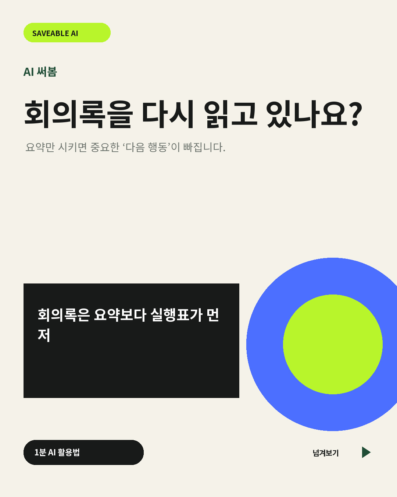
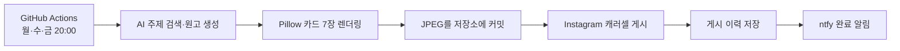

<div align="center">

# AI 써봄 Instagram 자동 게시기

### AI 주제 탐색부터 7장 카드뉴스 생성·게시·알림까지 자동화

<p>
  
  
  
  
</p>

**PC 실행 없이 월·수·금 오후 8시(KST) 자동 게시**

</div>

---

<div align="center">
  
</div>

## 📌 프로젝트 개요

| 항목 | 내용 |
|---|---|
| 운영 계정 | `@ai.sseobom` |
| 게시 일정 | 월·수·금 20:00 KST |
| 결과물 | 1080 × 1350 JPEG 카드 7장 |
| 실행 환경 | Python 3.12 · GitHub Actions |
| 핵심 목표 | 주제 선정부터 게시 기록까지 무인 자동화 |

## ✨ 핵심 기능

- 최신 AI 주제 웹 검색 및 초보 직장인용 콘텐츠 선정
- OpenAI Responses API 기반 7장 원고 JSON 생성
- Pillow 템플릿 기반 카드 이미지 렌더링
- Instagram Graph API 기반 캐러셀 게시
- 게시 성공 기록 및 최근 주제 중복 방지
- ntfy 기반 게시 완료 알림
- GitHub Actions 동시 실행 방지 및 20분 타임아웃

## 🔄 동작 흐름



## 🗂️ 프로젝트 구조

```text
.
├── .github/workflows/post.yml   # 예약 실행 및 전체 자동화
├── src/
│   ├── generate.py              # 주제·원고 생성 및 카드 렌더링
│   └── publish.py               # Instagram 게시 및 알림
├── generated/current/           # 최신 카드 이미지와 게시 데이터
├── data/state.json              # 최근 게시 주제와 게시 이력
├── config.json                  # 모델·색상·콘텐츠 설정
└── requirements.txt             # Python 의존성
```

## 🚀 로컬에서 카드 생성

### 요구 사항

- Python 3.12
- Noto Sans KR 또는 Noto Sans CJK
- OpenAI API 키

### 설치 및 실행

```bash
git clone https://github.com/LeeMS0122/ai-sseobom-instagram-automation.git
cd ai-sseobom-instagram-automation
pip install -r requirements.txt
```

프로젝트 루트에 `.env.local` 생성

```env
OPENAI_API_KEY=your_api_key
```

카드 생성

```bash
python src/generate.py
```

생 위치: `generated/current/01.jpg` ~ `07.jpg`

## 🔐 GitHub Actions 설정

저장소 `Settings → Secrets and variables → Actions`에 등록할 값

| Secret | 용도 |
|---|---|
| `OPENAI_API_KEY` | AI 주제 검색 및 원고 생성 |
| `INSTAGRAM_ACCESS_TOKEN` | Instagram Graph API 인증 |
| `INSTAGRAM_USER_ID` | 게시 대상 Instagram 계정 |
| `NTFY_TOPIC` | 게시 완료 알림 채널 |

> 비밀 값의 저장소 커밋 금지

## 💰 비용·안전 설계

- 이미지 생성 모델 대신 Pillow 템플릿 렌더링
- 게시 1회당 원고 생성 1회와 웹 검색 1회
- 최근 20개 게시 주제 확인을 통한 중복 방지
- 확인되지 않은 최신 기능·수치 단정 방지
- API 토큰과 사용자 ID의 GitHub Secrets 분리

## 🧰 기술 스택

<p>
  
  
  
  
</p>

---

<div align="center">

[](https://github.com/LeeMS0122)
[](https://cake-oviraptor-b43.notion.site/314eefba1b6d81538fe2f56c4adb52b9?source=copy_link)

</div>
